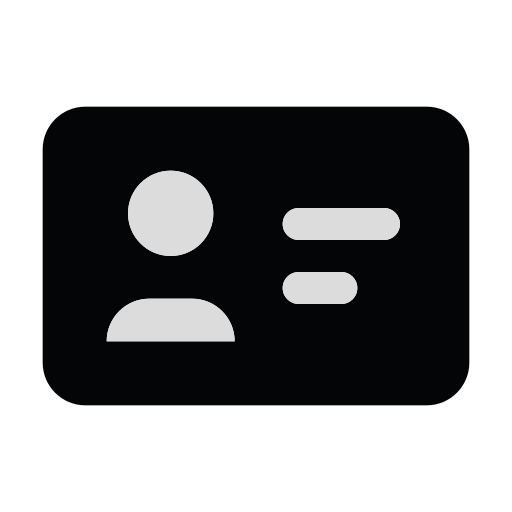
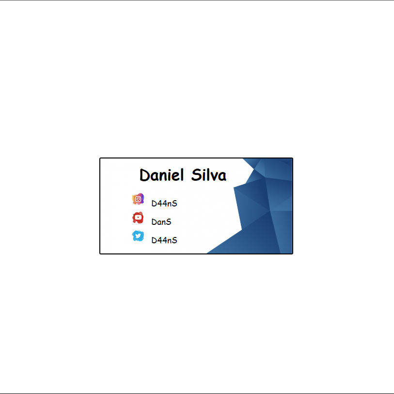

<div align="center">
  
</div>

<h1 align='center'>
 <p>My Business Card</p>
</h1>

### 📕 About

Business card 2.0 created to certify me with all CSS learning

<div align="center">
  
</div>

<div align="center">
<div>
<span>Version 1.0 X </span>
<span>Version 2.0</span>
</div>
  
  
</div>

#

### ❓ Why the app

In my first repository [Iniciando Na Programação](https://github.com/dan-ia/IniciandoNaProgramacao) I had a project called Card, where I had to create a personal card and add my links.

After a more mature learning period, I decided to recreate the project, only now with all the skills I had developed with CSS.

#


### ⛏️ Tools used

- [HTML](https://developer.mozilla.org/en-US/docs/Web/HTML)
- [CSS](https://developer.mozilla.org/pt-BR/docs/Web/CSS)

#

### 🤝🏽 How to contribute

You need to have [Node](https://nodejs.org/en/download), [Git](https://git-scm.com/download/win) and [VsCode](https://code.visualstudio.com/download) installed on your computer.


#### Follow the step by step

````bash
    # Clone the project
    $ git clone git@github.com:dan-ia/My-Business-Card.git

    # Enter directory
    $ cd My-Business-Card

     # Open project in VsCode
     code .
````
<div align="center">

<br>

<h3> Any questions? Contact me! 🩵✌️</h3>

[](https://www.linkedin.com/in/dan-ia/)
[](mailto:danieillsilvarv411@gmail.com)


</div>

